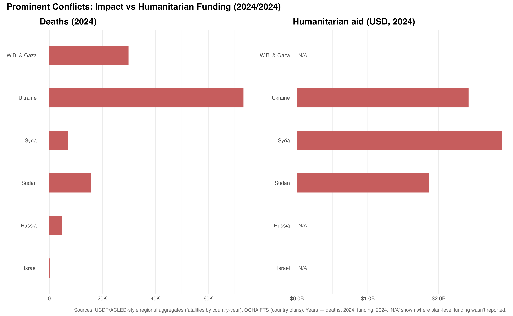
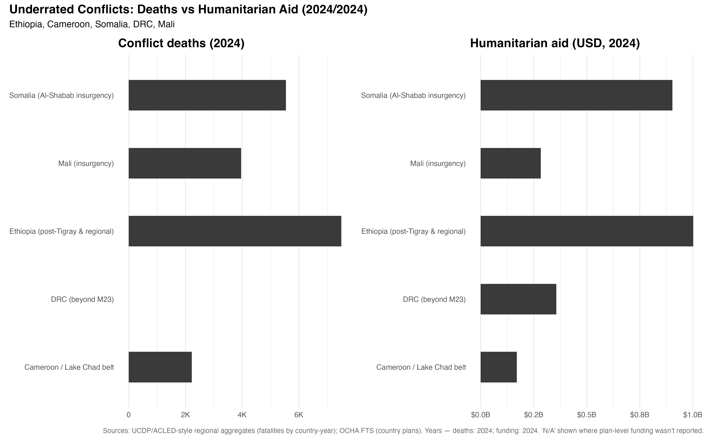

# Conflict_and_Humanitarian_aid
Analysis of conflict deaths vs humanitarian aid (prominent vs underrated conflicts) using UCDP, OCHA, and World Bank data.
# Conflict and Humanitarian Aid Analysis (2024)

This project explores the relationship between reported conflict deaths and humanitarian aid distribution.  
I compared **prominent conflicts** (Ukraine, Israel, Sudan, Syria, Gaza) with **underrated conflicts** (Ethiopia, Mali, Somalia, DRC, Cameroon).  

The goal is to highlight how **humanitarian responses often mirror global attention**, even when suffering does not align with headlines.  

---

## 📊 Visualizations

### Prominent Conflicts: Impact vs Humanitarian Funding

### Underrated Conflicts: Deaths vs Humanitarian Aid

---

## 📂 Files in this Repository
- `prominent_conflicts.png` → Chart showing deaths vs aid for most talked-about conflicts  
- `underrated_conflicts.png` → Chart showing deaths vs aid for underrated conflicts  
- `ocha_funding.csv` → Humanitarian funding data from OCHA  
- `ucdp_conflict_deaths.csv` → Conflict death data from UCDP  
- `population_dataset.csv` → World Bank WDI population data  
- Regional aggregated datasets: Africa, Middle East, Europe-Central Asia  

---

## 📂 Data Sources
- **UCDP Battle-Related Deaths (bd_best)** – conflict death estimates  
- **OCHA Financial Tracking Service** – humanitarian aid funding  
- **World Bank WDI** – population data  

---

## 🔎 Key Findings
- Prominent conflicts often receive proportionally higher humanitarian aid.  
- Underrated conflicts, despite high death tolls, receive less visibility and resources.  
- Aid often mirrors *attention*, not necessarily *need*.  

---

## 💡 Reflection
This is my **first international data project** outside of coursework for my MSBA at Georgetown.  
It reflects my long-term goal of combining **data analytics and international affairs** to highlight both challenges and opportunities in global outreach.  

---

👩🏻‍💻 Author: Phoebe Lamb ([@phoebelamb411](https://github.com/phoebelamb411))  
