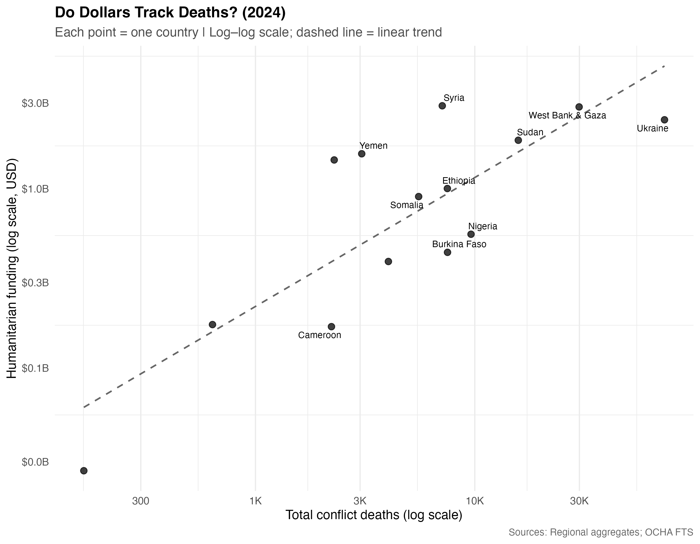
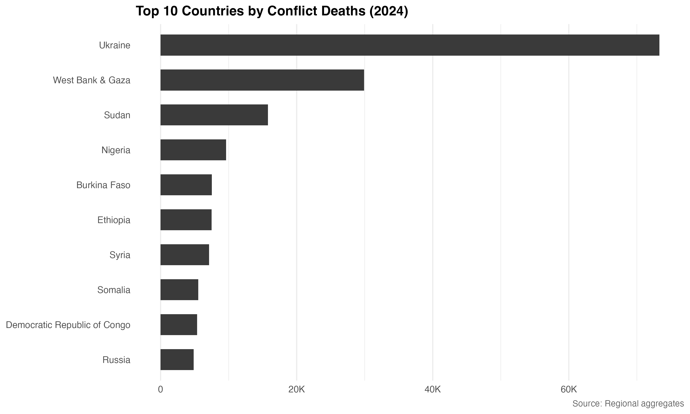
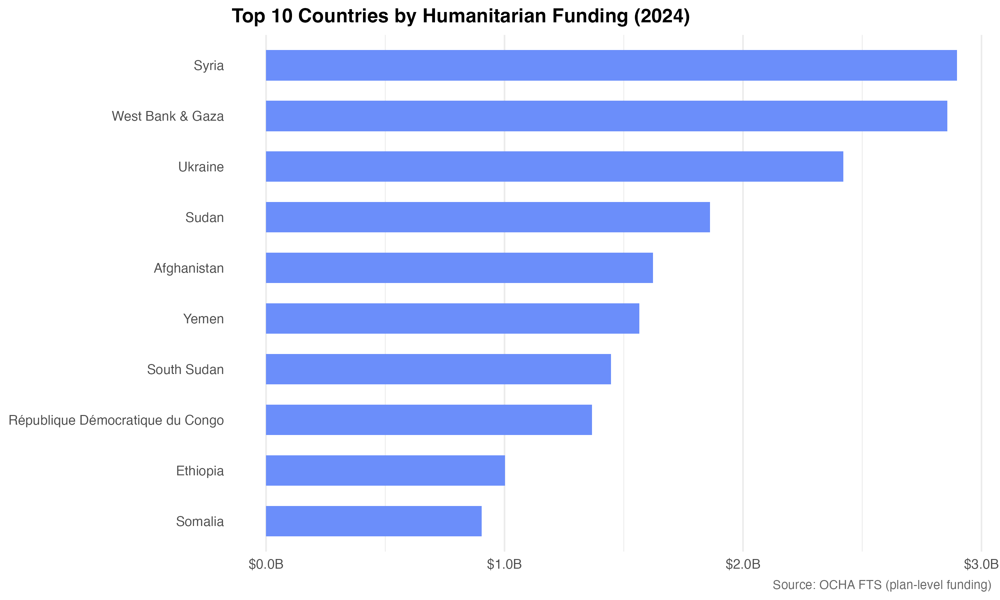
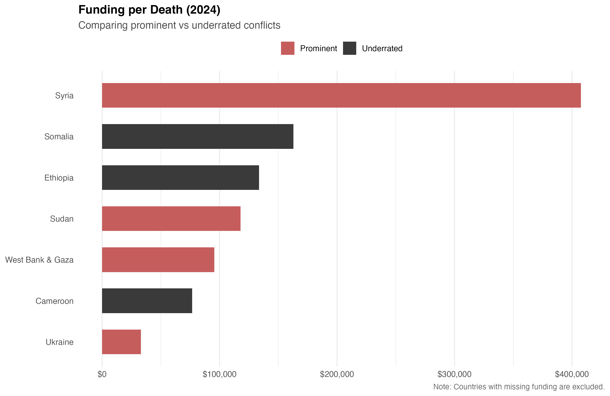

# Conflict Deaths vs Humanitarian Aid: The Attention Gap


---

## 🎯 Research Question

**Do humanitarian aid allocations align with conflict severity, or do they follow media attention?**

This analysis compares **conflict deaths** to **humanitarian funding** across two groups:
- **Prominent conflicts** (high media coverage): Ukraine, Gaza, Sudan, Syria
- **Underrated conflicts** (low media coverage): Ethiopia, Mali, Somalia, DRC

---

## 🔍 Key Finding

**Humanitarian responses often mirror global attention more than actual need.**

When conflicts dominate headlines (Ukraine, Gaza), aid follows. But devastating crises with lower media visibility—Ethiopia's intercommunal violence, Mali's insurgencies, Somalia's persistent conflict—receive far less funding despite massive human cost.

---

## 📊 Visualizations

### The Full Picture: Deaths vs Funding Landscape

<p align="center">
  
</p>

**What this shows:** Each dot represents a country in crisis. The dashed line shows the expected relationship between deaths and funding. Countries **above the line** receive more funding per death than average; countries **below** receive less. Notice how prominent conflicts (Ukraine, West Bank & Gaza, Syria) cluster above the trend, while many African conflicts fall below.

---

### Who Bears the Heaviest Toll?

<p align="center">
  
</p>

**The deadliest conflicts in 2024:** Ukraine leads in reported deaths, followed by West Bank & Gaza and Sudan. But look at Nigeria, Burkina Faso, Ethiopia, and DRC—these conflicts claim thousands of lives yet rarely make international headlines.

---

### Where Does the Money Go?

<p align="center">
  
</p>

**Humanitarian funding allocation:** Syria, West Bank & Gaza, and Ukraine receive the most funding. Compare this to the deaths chart above—do you see the gap? Countries like Nigeria and Burkina Faso have high death tolls but don't appear in the top 10 for funding.

---

### The Funding Gap: Prominent vs Underrated

<p align="center">
  
</p>

**The stark reality:** This chart reveals the disparity. Syria receives over **$400,000 per death** in humanitarian funding. Meanwhile, Cameroon, Ethiopia, and Somalia—with thousands of deaths—receive a fraction of that amount per person lost.

**Why it matters:** This isn't about whether any crisis deserves more or less. It's about revealing systematic patterns: when conflicts make headlines, resources follow. When they don't, populations suffer with far less support.

---

## 💡 What the Data Shows

### **Prominent Conflicts (2024)**
- **Countries analyzed**: Ukraine, Russia, Israel, West Bank & Gaza, Sudan, Syria
- **Pattern**: High media visibility correlates with substantial humanitarian funding
- **Funding per death**: Significantly higher than underrated conflicts

### **Underrated Conflicts (2024)**
- **Countries analyzed**: Ethiopia, Cameroon, Somalia, Democratic Republic of the Congo, Mali
- **Pattern**: Lower media coverage despite substantial death tolls
- **Funding per death**: Fraction of what prominent conflicts receive

**The Gap:** Prominent conflicts receive substantially more funding per death than underrated conflicts—revealing how media attention shapes humanitarian resource allocation.

---

## 🛠️ Methodology

### **Data Sources**
1. **Conflict Deaths**: UCDP/ACLED regional aggregates
   - Africa aggregated data (up to Aug 2025)
   - Middle East aggregated data (up to Aug 2025)
   - Europe-Central Asia aggregated data (up to Aug 2025)

2. **Humanitarian Funding**: OCHA Financial Tracking Service
   - Country-level humanitarian response plans
   - Official funding reports for 2024

### **Analysis Approach**
1. Standardized country names across different data sources
2. Aggregated conflict deaths by country for 2024
3. Extracted country-level funding from OCHA plan titles
4. Created visualizations comparing deaths and funding
5. Calculated funding per death for each group

### **Technical Highlights**
- **Data cleaning**: Built comprehensive country name normalization to handle inconsistencies across OCHA, ACLED, and World Bank datasets
- **Parsing challenge**: Extracted country names from humanitarian plan titles using regex patterns for both English and French
- **Missing data**: Transparently indicated countries with funding gaps rather than assuming zero
- **Visualization**: Log-log scatter plot reveals relationship across orders of magnitude

### **Country Groups**

**Prominent (High Media Attention):**
- Ukraine - Large-scale war since 2022
- Russia - Involved in Ukraine conflict
- Israel - Gaza war since October 2023
- West Bank & Gaza - Ongoing humanitarian crisis
- Sudan - Civil war with massive displacement
- Syria - Long-running conflict

**Underrated (Low Media Attention):**
- Ethiopia - Post-Tigray regional violence
- Somalia - Al-Shabab insurgency
- Mali - Armed group insurgencies
- DRC - Multiple conflicts beyond M23
- Cameroon - Lake Chad region violence

---

## 📂 Repository Structure

```
Conflict_and_Humanitarian_aid/
├── conflict_aid_analysis.R              # Main analysis script
├── figures/                             # All generated visualizations
│   ├── scatter_deaths_vs_funding_2024.png
│   ├── top10_deaths_2024.png
│   ├── top10_funding_2024.png
│   └── funding_per_death_groups_2024.png
├── data/
│   ├── ocha_funding.csv                 # OCHA funding data
│   ├── Africa_aggregated_data.xlsx      # Regional death data
│   ├── Middle-East_aggregated_data.xlsx
│   └── Europe-Central-Asia_aggregated_data.xlsx
└── README.md                            # This file
```

---

## 🚀 Quickstart

### **Prerequisites**
```r
# Install required packages
install.packages(c("tidyverse", "readxl", "janitor", "scales", "patchwork", "ggrepel"))
```

### **Run the Analysis**
```r
# Load and run the script
source("conflict_aid_analysis.R")

# Outputs will be created in figures/ folder:
# - scatter_deaths_vs_funding_2024.png
# - top10_deaths_2024.png
# - top10_funding_2024.png
# - funding_per_death_groups_2024.png
```

---

## 📈 What This Analysis Reveals

### **1. Media Attention Drives Funding**
Conflicts with high media coverage receive disproportionately more humanitarian aid per death than those with low coverage—even when death tolls are comparable.

### **2. Systematic Inequity**
Entire populations experiencing devastating loss receive far less visibility and resources simply because their crises don't dominate headlines.

### **3. The Forgotten Crises**
- **Ethiopia**: Ongoing intercommunal violence, severe displacement, minimal international coverage
- **Mali & Burkina Faso**: Persistent insurgencies, massive civilian impact, rarely in headlines
- **Eastern DRC**: Multiple overlapping conflicts, millions displaced, chronically underfunded
- **Somalia**: Decades of Al-Shabab violence, overshadowed by state-vs-state wars

### **4. Resource Allocation Patterns**
When we only talk about certain conflicts, humanitarian responses mirror that attention. This creates a feedback loop where visibility determines funding, regardless of objective need metrics.

---

## 💭 Personal Reflection

This was my **first international data project** outside of coursework for my MSBA at Georgetown.

**The reality:** It took nearly a week of 8+ hour days to produce these visualizations—far longer than I expected. The challenge wasn't just the coding (learning to wrangle multiple data sources with inconsistent naming), but also the weight of what the numbers represent.

Every data point is a life lost. Every gap in funding represents real people not receiving help they need.

While I'm fortunate to sit behind a laptop analyzing data, millions worldwide don't know when their next meal will come or where they'll find safety. That reality fueled every hour of this project.

**What I learned:**
- Real-world data is messy (country names alone took hours to standardize)
- Trial and error is part of the process (multiple approaches before finding what worked)
- The story matters more than perfection (getting these insights out matters more than perfect code)

This reflects my long-term goal: combining **data analytics and international affairs** to illuminate both challenges and opportunities in global humanitarian response.

---

## 🌟 Why This Matters

### **For Policymakers**
- Reveals systematic gaps in resource allocation
- Shows where needs aren't meeting funding
- Provides data for evidence-based aid prioritization

### **For Humanitarian Organizations**
- Identifies chronically underfunded crises
- Supports advocacy for overlooked populations
- Demonstrates scale of attention-vs-need misalignment

### **For the Public**
- Highlights conflicts that don't make headlines
- Challenges assumptions about where help is needed most
- Connects media coverage to real-world consequences

---

## ⚠️ Limitations & Caveats

### **Data Limitations**
1. **Conflict death data**: 
   - Based on reported deaths (actual tolls often higher)
   - Different data sources use different methodologies
   - Some conflicts have better reporting than others

2. **Funding data**:
   - Only captures official humanitarian response plans
   - Doesn't include bilateral aid or private donations
   - Some countries may receive funding not reflected in OCHA data

3. **Time lag**:
   - Aid allocations can lag behind conflict escalation
   - Data represents 2024 but situations evolve rapidly

### **Methodological Notes**
1. **Country groupings**: "Prominent" vs "Underrated" based on 2024 media coverage (subjective but observable)
2. **Funding per death**: Useful comparison metric but doesn't capture aid complexity
3. **Regional aggregation**: Some conflicts span borders or regions

### **What This Doesn't Show**
- Aid effectiveness or outcomes
- Historical funding trends over time
- Non-financial humanitarian support
- Refugee costs outside conflict zones

---

## 📚 Data Sources & Citations

### **Conflict Deaths**
- **UCDP (Uppsala Conflict Data Program)**: Battle-related deaths database
- **ACLED**: Regional conflict event aggregates
- Accessed: August 2025

### **Humanitarian Funding**
- **OCHA Financial Tracking Service**: https://fts.unocha.org
- Country-level humanitarian response plan funding
- Data year: 2024

---

## 🔗 Related Work

This is **Part 1** of my international affairs analytics portfolio:

- **Part 1**: [Conflict & Humanitarian Aid](https://github.com/phoebelamb411/Conflict_and_Humanitarian_aid) ✅ (This project)
- **Part 2**: [Paris Agreement Emissions Tracking](https://github.com/phoebelamb411/Paris_Agreement_Part_1) ✅
- **Part 3**: [Climate Finance Fairness](https://github.com/phoebelamb411/Paris_Agreement_Part_2) ✅

---

## 📜 License

Code: [MIT License](LICENSE)  
Data: See individual source licenses (UCDP, OCHA, World Bank)

---

## 💬 Let's Discuss

I'm building this portfolio to demonstrate how data analytics can drive accountability in international affairs. I'd love to hear:

- **Your perspectives** on humanitarian resource allocation
- **Data sources** I should explore
- **Questions** this analysis raises for you
- **Opportunities** to collaborate on similar work

**Connect with me:**
- 💼 [LinkedIn](https://www.linkedin.com/in/phoebelamb)
- 📊 [GitHub](https://github.com/phoebelamb411)

---

## 🙏 Acknowledgments

- **UCDP/ACLED** for maintaining accessible conflict data
- **OCHA** for transparent humanitarian funding reporting
- **Georgetown MSBA program** for analytical foundation
- **Everyone working in humanitarian response** on the ground

---

<div align="center">

*"When we only talk about certain conflicts, humanitarian responses mirror that attention.*  
*But suffering doesn't always align with headlines."*

**Building analytics for global awareness—one project at a time.**

</div>