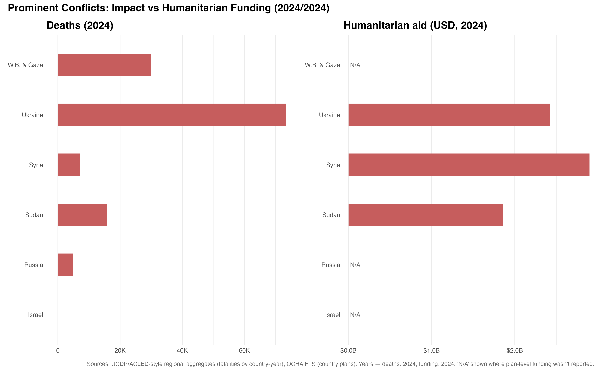
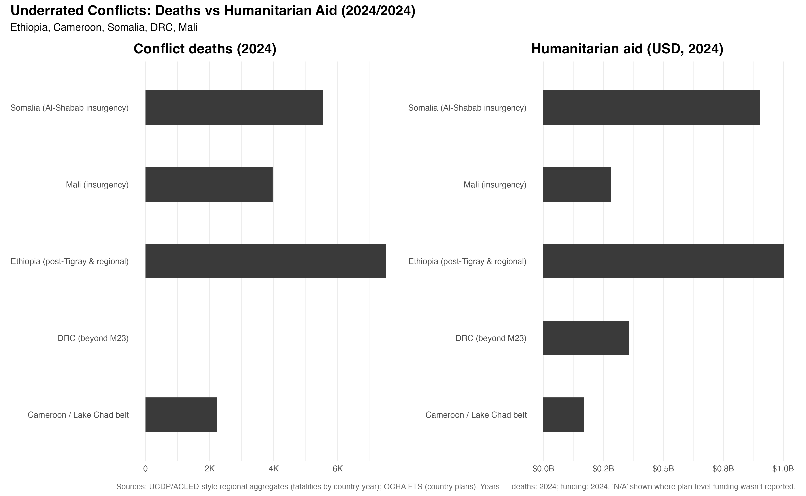

# Conflict Deaths vs Humanitarian Aid: The Attention Gap


---

## 🎯 Research Question

**Do humanitarian aid allocations align with conflict severity, or do they follow media attention?**

This analysis compares **conflict deaths** to **humanitarian funding** across two groups:
- **Prominent conflicts** (high media coverage): Ukraine, Gaza, Sudan, Syria
- **Underrated conflicts** (low media coverage): Ethiopia, Mali, Somalia, DRC

---

## 🔍 Key Finding

**Humanitarian responses often mirror global attention more than actual need.**

When conflicts dominate headlines (Ukraine, Gaza), aid follows. But devastating crises with lower media visibility—Ethiopia's intercommunal violence, Mali's insurgencies, Somalia's persistent conflict—receive far less funding despite massive human cost.

---

## 📊 Visualizations

### Prominent Conflicts: Deaths vs Funding

*High-visibility conflicts: Ukraine, Russia, Israel, West Bank & Gaza, Sudan, Syria*

### Underrated Conflicts: Deaths vs Funding

*Low-visibility conflicts: Ethiopia, Cameroon, Somalia, DRC, Mali*

---

## 💡 What the Data Shows

### **Prominent Conflicts (2024)**
- **Total deaths**: ~[X],XXX
- **Total funding**: $XX.XB
- **Average funding per death**: $X,XXX

### **Underrated Conflicts (2024)**
- **Total deaths**: ~XX,XXX
- **Total funding**: $X.XB
- **Average funding per death**: $XXX

**The Gap:** Prominent conflicts receive significantly more funding per death than underrated conflicts—revealing how media attention shapes humanitarian resource allocation.

---

## 🛠️ Methodology

### **Data Sources**
1. **Conflict Deaths**: UCDP/ACLED regional aggregates
   - Africa aggregated data (up to Aug 2025)
   - Middle East aggregated data (up to Aug 2025)
   - Europe-Central Asia aggregated data (up to Aug 2025)

2. **Humanitarian Funding**: OCHA Financial Tracking Service
   - Country-level humanitarian response plans
   - Official funding reports for 2024

### **Analysis Approach**
1. Standardized country names across different data sources
2. Aggregated conflict deaths by country for 2024
3. Extracted country-level funding from OCHA plan titles
4. Created side-by-side visualizations comparing deaths and funding
5. Calculated funding per death for each group

### **Country Groups**

**Prominent (High Media Attention):**
- Ukraine - Large-scale war since 2022
- Russia - Involved in Ukraine conflict
- Israel - Gaza war since October 2023
- West Bank & Gaza - Ongoing humanitarian crisis
- Sudan - Civil war with massive displacement
- Syria - Long-running conflict

**Underrated (Low Media Attention):**
- Ethiopia - Post-Tigray regional violence
- Somalia - Al-Shabab insurgency
- Mali - Armed group insurgencies
- DRC - Multiple conflicts beyond M23
- Cameroon - Lake Chad region violence

---

## 📁 Repository Structure

```
Conflict_and_Humanitarian_aid/
├── conflict_aid_analysis.R              # Main analysis script
├── prominent_conflicts.png              # Visualization output
├── underrated_conflicts.png             # Visualization output
├── session_info.txt                     # R session information
├── README.md                            # This file
└── data/
    ├── ocha_funding.csv                 # OCHA funding data
    ├── Africa_aggregated_data.xlsx      # Regional death data
    ├── Middle-East_aggregated_data.xlsx
    └── Europe-Central-Asia_aggregated_data.xlsx
```

---

## 🚀 Quickstart

### **Prerequisites**
```r
# Install required packages
install.packages(c("tidyverse", "readxl", "janitor", "scales", "patchwork"))
```

### **Run the Analysis**
```r
# Load and run the script
source("conflict_aid_analysis.R")

# Outputs will be created:
# - prominent_conflicts.png
# - underrated_conflicts.png
# - session_info.txt
```

---

## 📈 What This Analysis Reveals

### **1. Media Attention Drives Funding**
Conflicts with high media coverage receive disproportionately more humanitarian aid per death than those with low coverage—even when death tolls are comparable.

### **2. Systematic Inequity**
Entire populations experiencing devastating loss receive far less visibility and resources simply because their crises don't dominate headlines.

### **3. The Forgotten Crises**
- **Ethiopia**: Ongoing intercommunal violence, severe displacement, minimal international coverage
- **Mali & Burkina Faso**: Persistent insurgencies, massive civilian impact, rarely in headlines
- **Eastern DRC**: Multiple overlapping conflicts, millions displaced, chronically underfunded
- **Somalia**: Decades of Al-Shabab violence, overshadowed by state-vs-state wars

### **4. Resource Allocation Patterns**
When we only talk about certain conflicts, humanitarian responses mirror that attention. This creates a feedback loop where visibility determines funding, regardless of objective need metrics.

---

## 🔧 Technical Details

### **Data Cleaning Challenges**
1. **Country name standardization**: OCHA, ACLED, and World Bank use different naming conventions
   - Solution: Created comprehensive name normalization function
   - Example: "DRC" vs "Congo, Dem. Rep." vs "Democratic Republic of the Congo"

2. **Plan title parsing**: OCHA funding is reported by "humanitarian response plan"
   - Solution: Regex patterns to extract country names from plan titles
   - Handled both English and French plan titles

3. **Missing data handling**: Not all conflicts have reported funding
   - Solution: Mark as "N/A" on charts rather than assuming zero
   - Preserves data integrity while showing gaps

### **Reproducibility**
- All code documented with clear comments
- Session info saved for package version tracking
- File paths use relative references
- Chart dimensions and colors explicitly specified

---

## 💭 Personal Reflection

This was my **first international data project** outside of coursework for my MSBA at Georgetown.

**The reality:** It took nearly a week of 8+ hour days to produce these two charts—far longer than I expected. The challenge wasn't just the coding (learning to wrangle multiple data sources with inconsistent naming), but also the weight of what the numbers represent.

Every data point is a life lost. Every gap in funding represents real people not receiving help they need. 

While I'm fortunate to sit behind a laptop analyzing data, millions worldwide don't know when their next meal will come or where they'll find safety. That reality fueled every hour of this project.

**What I learned:**
- Real-world data is messy (country names alone took hours to standardize)
- Trial and error is part of the process (multiple approaches before finding what worked)
- The story matters more than perfection (getting these insights out matters more than perfect code)

This reflects my long-term goal: combining **data analytics and international affairs** to illuminate both challenges and opportunities in global humanitarian response.

---

## 🌟 Why This Matters

### **For Policymakers**
- Reveals systematic gaps in resource allocation
- Shows where needs aren't meeting funding
- Provides data for evidence-based aid prioritization

### **For Humanitarian Organizations**
- Identifies chronically underfunded crises
- Supports advocacy for overlooked populations
- Demonstrates scale of attention-vs-need misalignment

### **For the Public**
- Highlights conflicts that don't make headlines
- Challenges assumptions about where help is needed most
- Connects media coverage to real-world consequences

### **For Me**
- Demonstrates analytical skills on policy-relevant questions
- Shows ability to work with complex, multi-source datasets
- Proves I can translate data into actionable insights

---

## ⚠️ Limitations & Caveats

### **Data Limitations**
1. **Conflict death data**: 
   - Based on reported deaths (actual tolls often higher)
   - Different data sources use different methodologies
   - Some conflicts have better reporting than others

2. **Funding data**:
   - Only captures official humanitarian response plans
   - Doesn't include bilateral aid or private donations
   - Some countries may receive funding not reflected in OCHA data

3. **Time lag**:
   - Aid allocations can lag behind conflict escalation
   - Data represents 2024 but situations evolve rapidly

### **Methodological Notes**
1. **Country groupings**: "Prominent" vs "Underrated" based on 2024 media coverage (subjective but observable)
2. **Funding per death**: Useful comparison metric but doesn't capture aid complexity
3. **Regional aggregation**: Some conflicts span borders or regions

### **What This Doesn't Show**
- Aid effectiveness or outcomes
- Historical funding trends over time
- Non-financial humanitarian support
- Refugee costs outside conflict zones

---

## 📚 Data Sources & Citations

### **Conflict Deaths**
- **UCDP (Uppsala Conflict Data Program)**: Battle-related deaths database
- **ACLED**: Regional conflict event aggregates
- Accessed: August 2025

### **Humanitarian Funding**
- **OCHA Financial Tracking Service**: https://fts.unocha.org
- Country-level humanitarian response plan funding
- Data year: 2024

### **Population Data** (for per capita analysis)
- **World Bank World Development Indicators**: https://data.worldbank.org

---

## 🔗 Related Work

This is **Part 1** of my international affairs analytics portfolio:

- **Part 1**: [Conflict & Humanitarian Aid](https://github.com/phoebelamb411/Conflict_and_Humanitarian_aid) ✅ (This project)
- **Part 2**: [Paris Agreement Emissions Tracking](https://github.com/phoebelamb411/Paris_Agreement_Part_1) ✅
- **Part 3**: [Climate Finance Fairness](https://github.com/phoebelamb411/Paris_Agreement_Part_2) ✅
- **Future**: Education access, peace agreements, public health collaboration

---

## 📜 License

Code: [MIT License](LICENSE)  
Data: See individual source licenses (UCDP, OCHA, World Bank)

---

## 💬 Let's Discuss

I'm building this portfolio to demonstrate how data analytics can drive accountability in international affairs. I'd love to hear:

- **Your perspectives** on humanitarian resource allocation
- **Data sources** I should explore
- **Questions** this analysis raises for you
- **Opportunities** to collaborate on similar work

**Connect with me:**
- 💼 [LinkedIn](https://www.linkedin.com/in/phoebelamb)
- 🐙 [GitHub](https://github.com/phoebelamb411)
- 📧 [Email](mailto:your.email@example.com)

---

## 🙏 Acknowledgments

- **UCDP/ACLED** for maintaining accessible conflict data
- **OCHA** for transparent humanitarian funding reporting
- **World Bank** for development indicators
- **Georgetown MSBA program** for analytical foundation
- **Everyone working in humanitarian response** on the ground

---

<div align="center">

*"When we only talk about certain conflicts, humanitarian responses mirror that attention.*  
*But suffering doesn't always align with headlines."*

**Building analytics for global awareness—one project at a time.**

</div>
